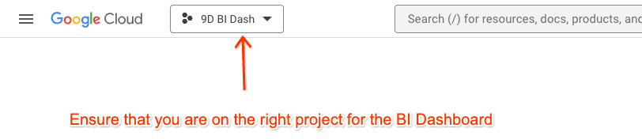
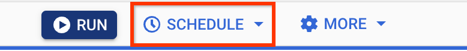
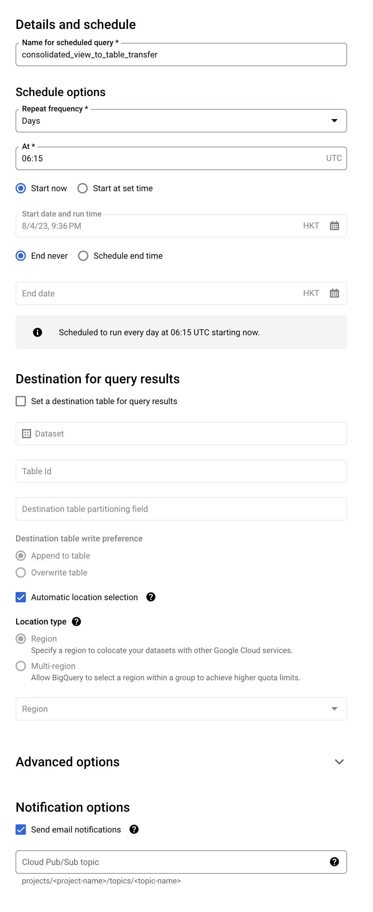
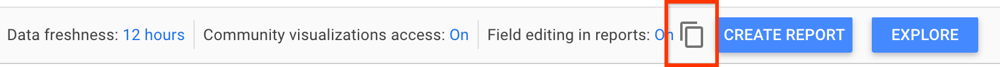

# Hyperion: BI Dashboard - Implementation Guide

<br>

**Disclaimer: This is not an official Google solution**

<br>

**CHECK OUT THE DEMO DASHBOARD HERE: [\[Demo\] Hyperion: BI Dashboard](https://lookerstudio.google.com/reporting/168815b0-75d0-4c63-9872-621decc90be6)**

- **[Join this Google Group for instant access](https://groups.google.com/a/professional-services.goog/g/solutions_hyperion-readers)**

<br>

**Solution Architecture Diagram: [Hyperion v2.0 Architecture](./assets/Hyperion_v2.0_Architecture.pdf)**

<br>

**Table of Contents**

1. [Gather accounts to link together](#gather-accounts-to-link-together)

    a. [Initial setup](#initial-setup)

    b. [AdMob setup](#admob-setup)

    c. [Play Console setup](#play-console-setup)

2. [AdMob](#admob)

    a. [Prepare](#prepare)

    b. [Deploy](#deploy)

    c. [Backfill](#backfill)

3. [Play Console](#play-console)

    a. [Prepare](#prepare-1)

    b. [Deploy](#deploy-1)

    c. [Backfill](#backfill-1)

4. [Google Ads](#google-ads)

    a. [Prepare](#prepare-2)

    b. [Backfill](#backfill-2)

    c. [Deploy](#deploy-2)

5. [Analytics](#analytics)

    a. [Prepare](#prepare-3)

    b. [Deploy](#deploy-3)

    c. [Backfill](#backfill-3)

6. [AppLovin Max](#applovin-max)

    a. [Prepare](#prepare-4)

    b. [Deploy](#deploy-4)

    c. [Backfill](#backfill-4)

7. [BigQuery](#bigquery)

    a. [Utility tables](#utility-tables)

      1. [Exchange Rate Table](#exchange-rate-table)

      2. [Google Ads Criteria ID to Country Code Mapping](#google-ads-criteria-id-to-country-code-mapping)

      3. [App IDs to App Categories Mapping](#app-ids-to-app-categories-mapping)

    b. [Consolidated View & Table](#consolidated-view-&-table)

8. [\[Optional\] Create a table to track the last updated date for each datasource](#optional-create-a-table-to-track-the-last-updated-date-for-each-datasource)

9. [Looker Studio](#looker-studio)

10. [FAQs](#faqs)

    a. [How to add a new Play Console account to the dashboard](#how-to-add-a-new-play-console-account-to-the-dashboard)

<br>

1) # Gather accounts to link together

   1) ## Initial setup

      1) Make a copy of the template for the BI Dashboard Accounts List [here](https://docs.google.com/spreadsheets/d/1xCeu81C9Unx50Re0bbj6zLD3qphuHwf2kBk246OZUBs/edit?usp=sharing), and fill it up with the company's accounts. This sheet will help to keep track of all accounts to be linked in the BI Dashboard.
      2) Create a new Google Cloud Platform (GCP) project with billing enabled and obtain owner access to that project.
      3) When done with the Accounts List sheet, join the Google Group [solutions_hyperion-readers](https://groups.google.com/a/professional-services.goog/g/solutions_hyperion-readers). This will allow you to access all the solution assets, including the dashboard template.


   2) ## AdMob setup

      1) Go to [https://console.cloud.google.com](https://console.cloud.google.com) and click on the project dropdown to change project to the new project

      

      2) We need to create a new OAuth client to access the AdMob API, for that we need to register a new application in this project first
      3) Go to API Library and enable the AdMob API
      4) Then, go to APIs & Services > Credentials in the left navigation menu
      5) Click CREATE CREDENTIALS > OAuth client ID
      6) You will need to create an OAuth consent screen first if you don’t have it with an AdMob scope already.
         1) Go through the process, selecting external user type for the OAuth consent screen
         2) Under app name, can name the app as AdMob Daily Reports
         3) Under both user support email and developer contact information, you can select your own email address
      7) Click ‘Add or remove scopes’, add AdMob API (.../auth/admob.readonly)  as the only scope and click ‘Update’, then click ‘Save and Continue’
      8) Click ‘Save and Continue’ on the Add Test User screen, and then click ‘Back to Dashboard’
      9) Now, under Publishing status, click ‘Publish App’ and then click ‘Confirm’
      10) Now, do steps iv and v once again
      11) Select Desktop app as the application type, give it a name (e.g. AdMob Daily Reports), then click Create
      12) You will now see a confirmation screen.

   3) ## Play Console setup

      1) On the Accounts Lists trix, under the column “Play Console (Email address for permissions)”, if your company has 10 or fewer Play Console accounts mentioned, input the <gcp-project-id>@appspot.gserviceaccount.com for each row. If they have more than 10 accounts, input <gcp-project-id>@appspot.gserviceaccount.com for each row up till 10 accounts, and then input <gcp-project-number>@developer.gserviceaccount.com for each row after the 10 till 20 accounts max.
         1) This is because each email address can only be granted access to max 10 accounts.
         2) **Play Console access:** Grant [Account Level access (Type: User) with the permission "View app information and download bulk reports (read-only) AND View financial data"](https://support.google.com/googleplay/android-developer/answer/9844686?sjid=2229058108467449126-EU#definitions&zippy=%2Cview-app-information-and-download-bulk-reports-read-only) for all the company's Google Play Console accounts to the email address mentioned on its right.
         3) **AdMob access:** Do the steps inside for each AdMob account you want to link: [\[External Friendly\] Generate AdMob Access Token for the BI Dashboard](https://docs.google.com/presentation/d/1yTm4N_cZupInOkJU35fvrqnyTIVtrx2vmlvtWaa11p0/edit?usp=sharing&resourcekey=0-wRs_q8wpFWGLSBXABfX4UA)
         4) **Analytics access:** Grant read access for all the relevant accounts to the service account created under the Play Console setup steps above (e.g.
            <gcp-project-id>@appspot.gserviceaccount.com)
         5) **AppLovin Max access:** Obtain the Reporting API key from the [AppLovin Max dashboard](https://dash.applovin.com/login#keys) if there is an ask to integrate AppLovin Max mediation data

2) # AdMob

   1) ## Prepare

      1) Clone this repository on your local machine
      2) Use Finder/File Explorer on your computer to go inside the admob folder and once inside, copy and paste all the admob tokens generated in the AdMob setup steps above
      3) Next, inside that folder, open the `client_secrets.json` file and replace its content with the content of the file downloaded in the last step under `AdMob setup (from gPS side)`

   2) ## Deploy

      1) Now, go back to the open terminal and run `cd hyperion/admob` to get inside the admob directory
      2) Run the following command to deploy the Cloud Function, create a new Pub/Sub topic, and set up a Cloud Scheduler:
         `sh deploy.sh --project <cloud-project-id>`
         Where `cloud-project-id` is your GCP project ID where you are deploying

   3) ## Backfill

      1) Backfill the data using either of the two options below:
         1) Option 1 (slower): Using GCP UI
            1) Go to [Pub/Sub](https://console.cloud.google.com/cloudpubsub/topic/list), and click on the topic ID we created earlier (i.e. get_admob_reports)
            2) Click on MESSAGES > PUBLISH MESSAGE and under Message Attributes, click ‘ADD AN ATTRIBUTE’:
               1) Add `backfill` as key and value as `True` to enable backfilling
                  1. If this is the first message you are publishing, add another attribute with `populate_apps_list` as key and value as `True`. This will populate the AdMob apps list in BQ. *You only need to do this step once when backfilling.*
               2) Add two more attributes with `start_date` and `end_date` as keys and values as the start and end dates of the backfill period (format of the dates should be in YYYY-MM-DD)
                  1. Try backfilling for two months at a time to not exceed the memory/time limits of the Cloud Function *([monitor logs](https://console.cloud.google.com/functions/details/us-central1/get_admob_reports) when backfilling for any errors/timeouts)*
                  2. If you don’t specify the end_date, it will default to yesterday’s date as of today. **That may lead to cloud function timeout since cloud functions can only run for 6 mins max.**
            3) Click ‘PUBLISH’ to invoke the backfilling function to backfill the AdMob data into the BigQuery for the backfill period specified in start_date and end_date above
            4) Now, repeat Steps 2 and 3 above until you have backfilled till today’s date
         2) Option 2 (faster): Using Terminal
            1) Open terminal and make sure you are inside admob directory
            2) Run the following commands:
               1) `export GCP_PROJECT=<your gcp project id>`
               2) `python3 -m venv .venv`
               3) `source .venv/bin/activate`
               4) `pip install --require-hashes -r requirements.txt`
               5) `python3 main.py --populate-apps-list=true --dry-run=false --backfill=true --start-date=YYYY-MM-DD --end-date=YYYY-MM-DD`
            3) This will lead to backfilling of admob data from start date onwards till end date

3) # Play Console

   1) ## Prepare

      1) Go to BigQuery and create a new dataset under the same project and name it `play_console_reporting_data`
      2) If code has been cloned in previous steps, run `cd ~; cd hyperion/play_feeds` in the terminal to change to the play feed automation folder
      3) Update `project_id` and `dataset_id` (i.e. play_console_reporting_data) values in config.yaml
      4) Inside the same `config.yaml` file, update the `mappings` variable according to the following format:

```
mappings:
  game account title:
    bucket: gcs_bucket_address
    table_suffix: destination_bigquery_table_suffix
```

* game account title: Enter the Play Console (Account Name) from the Accounts List created above
* bucket: Address of the Google Cloud Storage bucket storing reports **(starting with pubsite_prod)**. Enter the corresponding Play Console (Bucket Address) from the Accounts List created above.
* table_suffix: Enter a suffix for the table, e.g. if the suffix is ABC, Installs country report table ID will be: `<project_id>.play_console_reporting_data.p_Installs_country_ABC`
  * Make sure that each suffix **is unique** across the `play_console_reporting_data` dataset
  * You can also take help from GenAI tools like Bard for this step


    Sample prompt that you can use to generate the value of the mappings variable:

    `Using the below table:`


    `<copy and paste the Play Console (Account Name) and Play Console (Bucket Address) columns from the Accounts List>`


    `generate a mapping like in the example given below, where the table suffix is unique and uses the first letter of the game account title:`

        extreme racing games:
            bucket: gcs_bucket_address
            table_suffix: ERG


    As always, verify and check all output from GenAI tools before using it in production


  1) ## Deploy

     1) Verify that your terminal is inside the `play_feeds` folder and then, run the following commands:
        `sh deploy.sh --project <cloud_project_id> --topic play_feeds`

  2) ## Backfill

     1) Run
        `gcloud pubsub topics publish play_feeds_backfill --attribute="start_date=$start_date,end_date=$end_date report_requested=$report_requested"`
        1) start_date and end_date must be in YYYYMMDD format. E.g.
           `gcloud pubsub topics publish play_feeds_backfill --attribute="start_date=20220101,end_date=20220331,report_requested=installs"`
        2) Try backfilling for a quarter at a time until you reach today’s date
           1) **You will encounter an error if your backfill period overlaps Feb and March of 2023**. This is due to a slight change in the casing of one of the column names in Play Console reports between Feb and March of 2023. In that case, backfill for Feb and March ‘23 individually, then continue backfilling for a quarter if you like.

1) # Google Ads

   1) ## Prepare

      1) Navigate to your Google Ads MCC account (using Ads ICS read/write access), and then go to Scripts under Tools and Settings
      2) Create a new script, name it anything, e.g. `Export Ads report data to BQ`
      3) From the cloned repository from step 2, go to `ads/` directory and copy the contents of the `main.gs` file and paste it inside our new Google Ads script
      4) Then, click on Advanced APIs and select BigQuery
      5) Click the Authorize button to authorize the script to make changes on your behalf
      6) Inside the script, change the `BIGQUERY_PROJECT_ID` under `CONFIG` var to the your GCP project and dataset ID, and the set your Google Ads MCC account timezone under `timezone_MCC` var, and then click Save

   2) ## Backfill

      1) For backfilling, go back in the Ads script, set the `backfill` var to true and the `backfill_start_date` and `backfill_end_date` to the date range you want to backfill up to, and click Preview
         1) Backfill for a quarter at a time until you reach today’s date
      2) **Afterwards, set the `backfill` var to `false` to prevent backfilling from running again on the next scheduled run**

   3) ## Deploy

      1) Go back to ‘Scripts’ on Google Ads, and click under the frequency column for the script we just created. Set frequency settings: frequency as daily and time as 01:00 AM - 02:00 AM.

2) # Analytics

   1) ## Prepare

      1) Enable the Google Analytics Data API [[link](https://console.developers.google.com/marketplace/product/google/analyticsdata.googleapis.com)] and the Admin API [[link](https://console.developers.google.com/apis/api/analyticsadmin.googleapis.com/overview)] on the GCP console

   2) ## Deploy

      1) Download the code and go to the `analytics` directory
      2) Now, run the deploy script with the correct project_id. Make sure to change the service account in the `deploy.sh` file to the email address granted access for GA4.
         `sh deploy.sh --project <your gcp project id>`
         Where `your gcp project id` is your GCP project ID where you are deploying

   3) ## Backfill

      1) Go to pub/sub and send message to topic with start_date and end_date as attributes (YYYY-mm-dd format)

3) # AppLovin Max

   1) ## Prepare

      1) Obtain the API key from AppLovin Max dashboard [here](https://dash.applovin.com/login#keys)

   2) ## Deploy

      1) Download the code and go to the `applovin` directory and run the deploy script with the correct project_id
         `sh deploy.sh --project <your gcp project id>`
         Where `your gcp project id` is your GCP project ID where you are deploying

   3) ## Backfill

      1) AppLovin Max does not support long backfills hence, backfill functionality is not provided in this code

4) # BigQuery

   1) ## Utility tables

      1) ### Exchange Rate Table

         1) Since some of the child accounts under the your company's Google Ads MCC account may have a different currency than USD (PKR in this example), we also need to have a daily exchange rate table to convert all non-USD amounts to USD **(make sure that this table has exchange rate for all the dates you want your dashboard to have)**
            1) Go to your BigQuery and under the project, create a new dataset `bi_dashboard`
            2) Inside that dataset, create a new table from Drive with the name `usd_to_pkr` and use this public Google Sheet as the data source: [USD to PKR Daily Exchange Rate](https://docs.google.com/spreadsheets/d/10p017S8nQ2LczLyfuGetvzDTgfA4ctZKT9JszANqslI/edit#gid=0)
               1) File format is Google Sheet
               2) Schema as auto-detect, and under Advanced Options, set Header Rows to Skip as 1
            3) For any other currencies, can create a similar sheet as above and use Google Finance formula for similar exchange rate table for any currency to USD: `=GoogleFinance("CURRENCY:USD<currency code here>", "price", DATE(<start year here e.g. 2022>, <start month here e.g. 1>, <start date here e.g. 1>), TODAY(), "DAILY")`

      2) ### Google Ads Criteria ID to Country Code Mapping

         1) Since Google Ads reports have geolocations in the format of Criterion ID, we need a mapping table to map the Criterion IDs to ISO country codes since that is the format of the country in AdMob and Play Console reports.
            1) Download the latest zipped CSV of geo targets from this [link](https://developers.google.com/google-ads/api/data/geotargets)
            2) Unzip the file
            3) Under the bi_dashboard dataset created in the last step, create a new table from Upload named `geo_targets` and select file as the unzipped csv file we just created
               1) File format is CSV
               2) Schema as auto-detect, and under Advanced Options, set Header Rows to Skip as 1

      3) ### App IDs to App Categories Mapping

         1) To enable the app category (e.g. TRAVEL_AND_LOCAL, HEALTH_AND_FITNESS, GAME_ROLE_PLAYING) and category type (Non-Game or Game) filters on the BI Dashboard, and to see charts using these dimensions, do the following additional steps:
            1) Ask your market’s D&I POC to provide you an externalized trix for your portfolio of Android apps, or populate the trix yourself, with the following columns populated from your Google Play accounts: App_ID, App_Category, Category_Type
               1) Copy the trix template [here](https://docs.google.com/spreadsheets/d/15tuvpA__URdBeSXOH2B8y-phrPPQGvoVQrIzkE9s89w/edit?usp=sharing) using your gmail account
               2) If engaging with a market’s D&I POC, change share settings to ‘anyone with the link can view’ and share this link with your market’s D&I POC for them to use
                  1. **Also, add [`f1-trix-access@google.com`](mailto:f1-trix-access@google.com) and the D&I POC as an Editor to the trix.**
            2) Then, create a new table inside the bi_dashboard dataset named `app_categories`, just how we created the exchange rate table in i) above, this time using the link to the trix provided to the D&I POC as our data source
               1) For schema, click Edit as Text and paste the below schema as it is:
                  App_ID:STRING,
                  App_Category:STRING,
                  Category_Type:STRING

   2) ## Consolidated View & Table

      1) Create a new query file with the following content and save it as a view with the name `consolidated_view` under the `bi_dashboard` dataset
         1) In the SQL query below, complete the `package_name_to_division_mapping` subquery by following the pattern given and referring to the mappings in the config.yaml file we updated earlier for the Play Console under Step 3
            1) You can also take help from GenAI tools, like Gemini, for this step


Sample prompt that you can use to generate the subquery for the package_name_to_division_mapping:

`Be a helpful bot, and based on a given input, give me an output.`

`Use the sample input and output below for reference:`

`Sample input:`
```
Trusted Android Apps- PDF Reader & Documents Tools:
  bucket: pubsite_prod_925012328084686959323
  table_suffix: TAA

MusicCrush.com - Music Player, MP3 & Video Player:
  bucket: pubsite_prod_rev_343253632524122776110
  table_suffix: MCM
```

`Sample output:`
```sql
Select DISTINCT(Package_name), 'Trusted Android Apps- PDF Reader & Documents Tools' as Division_Name
FROM `play_console_reporting_data.p_Installs_country_TAA`
UNION ALL
Select DISTINCT(Package_name), 'MusicCrush.com - Music Player, MP3 & Video Player' as Division_Name
FROM `play_console_reporting_data.p_Installs_country_MCM`
```

`Your given input is:`
```
<copy and paste all the values under the mappings variable in the config.yaml file contents here>
```

`Based on this given input, give me an output similar to the sample output above. Thanks!`


As always, verify and check all output from GenAI tools before using it in production.

<br>

```sql
with admob_view as (
SELECT
t1.dimensionValues_DATE_value as Date,
t1.dimensionValues_COUNTRY_value as Country,
t2.app_store_id,
SUM(t1.metricValues_ESTIMATED_EARNINGS_microsValue) as Estimated_Earnings_micros,
SUM(t1.metricValues_IMPRESSIONS_integerValue) as Impressions
FROM `admob_reporting_data.admob_mediation_report_*` t1
JOIN (
SELECT app_store_id, app_id
FROM `admob_reporting_data.list_apps_*`
GROUP BY app_store_id, app_id
) t2
ON t1.dimensionValues_APP_value = t2.app_id
WHERE dimensionValues_DATE_value > '2004-01-01'
GROUP BY Date, Country, app_store_id
),
exchange_rates AS (
  WITH date_series AS (
    SELECT DISTINCT Date
    FROM `ads_reporting_data.google_ads_cost_report_*`
    WHERE Date > '2001-01-01'
  ),
  raw_rates AS (
    SELECT
      CAST(Date AS Date) AS Date,
      Close AS Exchange_Rate
    FROM `bi_dashboard.usd_to_pkr`
  )
  SELECT
    ds.Date,
    rr.Exchange_Rate,
    LAST_VALUE(rr.Exchange_Rate IGNORE NULLS) OVER (
      ORDER BY ds.Date
      ROWS BETWEEN UNBOUNDED PRECEDING AND CURRENT ROW
    ) AS Last_Available_Rate
  FROM date_series ds
  LEFT JOIN raw_rates rr ON ds.Date = rr.Date
),
ads_view AS (
   SELECT
     COALESCE(z1.Date, z2.Date) AS Date,
     COALESCE(z3.`Country Code`, 'IR') AS Country,
     COALESCE(z1.App_ID, z2.App_ID) AS App_ID,
     SUM(Cost_micros) AS Cost_micros,
     SUM(Paid_Installs) AS Paid_Installs
   FROM (
     SELECT
       t1.Date AS Date,
       Country,
       App_ID,
       CASE
        WHEN Currency = 'USD' THEN AVG(Cost)
        WHEN Currency = 'PKR' THEN
          CASE
            WHEN AVG(t4.Exchange_Rate) IS NOT NULL THEN CAST(AVG(Cost)/AVG(t4.Exchange_Rate) AS INT64)
            WHEN AVG(t4.Last_Available_Rate) IS NOT NULL THEN CAST(AVG(Cost)/AVG(t4.Last_Available_Rate) AS INT64)
            ELSE CAST(AVG(Cost)/275 AS INT64)  -- Fallback to a default rate of 275 PKR = 1 USD
          END
        END AS Cost_micros,
     FROM
       (
         SELECT
           Date,
           App_ID,
           Country,
           Currency,
           CAST(SUM(Cost) AS INT64) AS Cost,
         FROM
           `ads_reporting_data.google_ads_cost_report_*`
         WHERE
           Date > '2001-01-01'
         GROUP BY
           Date,
           App_ID,
           Country,
           Currency
       ) t1
     JOIN
       exchange_rates t4
     ON
       t1.Date = t4.Date
     GROUP BY
       Date,
       Country,
       App_ID,
       Currency) z1
   FULL JOIN (
     SELECT
       Date,
       Country,
       App_ID,
       CAST(SUM(Paid_Installs) AS INT64) AS Paid_Installs,
     FROM
       `ads_reporting_data.google_ads_install_report_*`
     WHERE
       Date > '2001-01-01'
     GROUP BY
       Date,
       App_ID,
       Country ) z2
   ON
     z1.App_ID = z2.App_ID
     AND z1.Date = z2.Date
     AND z1.Country = z2.Country
   LEFT JOIN
     `bi_dashboard.geo_targets` z3
   ON
     COALESCE(z1.Country, z2.Country) = SAFE_CAST(z3.`Criteria ID` AS string)
   GROUP BY
     Date,
     Country,
     App_ID
 ),

play_console_view as (
SELECT
Date,
COALESCE(Country, 'Unknown Region') as Country,
Package_name,
AVG(Daily_Device_Installs) as Daily_Device_Installs,
AVG(Daily_Device_Uninstalls) as Daily_Device_Uninstalls,
AVG(Daily_User_Installs) as Daily_User_Installs,
AVG(Daily_User_Uninstalls) as Daily_User_Uninstalls,
AVG(Active_Device_Installs) as Active_Device_Installs,
AVG(Install_events) as Install_events,
AVG(Uninstall_events) as Uninstall_events
FROM (SELECT * FROM `play_console_reporting_data.p_Installs_country_*`)
GROUP BY Date, Country, Package_name
),

earnings_view as (
 SELECT
   Transaction_Date as date,
   Product_id as package_name,
   Buyer_Country as country,
   SUM(Amount_Merchant_Currency_) as IAP_Earnings
 FROM
   `play_console_reporting_data.p_Earnings_*`
 GROUP BY
   date,
   package_name,
   country
),

analytics_view as (
 SELECT
   date,
   appId,
   countryId,
   MAX(active1DayUsers) as active1DayUsers,
   MAX(active7DayUsers) as active7DayUsers,
   MAX(active28DayUsers) as active28DayUsers,
   MAX(dauPerMau) as dauPerMau,
   MAX(dauPerWau) as dauPerWau,
   MAX(wauPerMau) as wauPerMau,
   MAX(averagePurchaseRevenuePerPayingUser) as averagePurchaseRevenuePerPayingUser,
   MAX(averageRevenuePerUser) as averageRevenuePerUser,
   MAX(sessionsPerUser) as sessionsPerUser,
   MAX(userEngagementDuration) as userEngagementDuration,
   MAX(day01ActiveUsers) as day01ActiveUsers,
   MAX(day01TotalUsers) as day01TotalUsers,
   MAX(day07ActiveUsers) as day07ActiveUsers,
   MAX(day07TotalUsers) as day07TotalUsers,
   MAX(day30ActiveUsers) as day30ActiveUsers,
   MAX(day30TotalUsers) as day30TotalUsers,
 FROM
   `analytics_reporting_data.analytics_report_*`
 GROUP BY
   date,
   appId,
   countryId
),

package_name_to_division_mapping as (
Select DISTINCT(Package_name), 'Trusted Android Apps- PDF Reader & Documents Tools' as Division_Name
from `play_console_reporting_data.p_Installs_country_TAA`
union all
Select DISTINCT(Package_name), 'MusicCrush.com - Music Player, MP3 & Video Player' as Division_Name
from `play_console_reporting_data.p_Installs_country_MCM`
union all
...
),

ranked_mappings AS (
SELECT *,
ROW_NUMBER() OVER (PARTITION BY Package_name ORDER BY Division_Name) AS rn
FROM package_name_to_division_mapping
),

unique_package_name_to_division_mapping as (
SELECT *
FROM ranked_mappings
WHERE rn = 1 -- Select only the first row for each package
)

-- consolidated view starts here

SELECT
 COALESCE(t1.Date, t2.Date, t3.Date, t7.date, t9.date) AS Date,
 COALESCE(t8.country_name, t1.Country, t2.Country, t3.Country, t7.countryId, t9.country) AS Country,
 COALESCE(t1.app_store_id, t2.Package_name, t3.App_ID, t7.appId, t9.package_name) AS App_ID,
 COALESCE(MAX(t5.app_store_display_name), '-') AS App_Name,
 COALESCE(MAX(t4.Division_Name), '-') AS Division_Name,
 COALESCE(MAX(t6.App_Category), '-') AS App_Category,
 COALESCE(MAX(t6.Category_Type), '-') AS Category_Type,
 SUM(CAST(COALESCE(t1.Estimated_Earnings_micros, 0) AS INT64)) AS Estimated_Earnings_micros,
 SUM(CAST(COALESCE(t9.IAP_Earnings, 0) AS FLOAT64)) AS IAP_Earnings,
 SUM(CAST(COALESCE(t1.Impressions, 0) AS INT64)) as Impressions,
 SUM(CAST(COALESCE(t3.Cost_micros, 0) AS INT64)) AS Cost_micros,
 SUM(CAST(COALESCE(t3.Paid_Installs, 0) AS INT64)) AS Paid_Installs,
 SUM(CAST(COALESCE(t2.Daily_Device_Installs, 0) AS INT64)) AS Daily_Device_Installs,
 SUM(CAST(COALESCE(t2.Daily_Device_Uninstalls, 0) AS INT64)) AS Daily_Device_Uninstalls,
 SUM(CAST(COALESCE(t2.Daily_User_Installs, 0) AS INT64)) AS Daily_User_Installs,
 SUM(CAST(COALESCE(t2.Daily_User_Uninstalls, 0) AS INT64)) AS Daily_User_Uninstalls,
 SUM(CAST(COALESCE(t2.Active_Device_Installs, 0) AS INT64)) AS Active_Device_Installs,
 SUM(CAST(COALESCE(t2.Install_events, 0) AS INT64)) AS Install_events,
 SUM(CAST(COALESCE(t2.Uninstall_events, 0) AS INT64)) AS Uninstall_events,
 SUM(CAST(COALESCE(t7.active1DayUsers, 0) AS INT64)) AS Active_1Day_Users,
 SUM(CAST(COALESCE(t7.active7DayUsers, 0) AS INT64)) AS Active_7Day_Users,
 SUM(CAST(COALESCE(t7.active28DayUsers, 0) AS INT64)) AS Active_28Day_Users,
 SUM(CAST(COALESCE(t7.dauPerMau, 0) AS FLOAT64)) AS Dau_Per_Mau,
 SUM(CAST(COALESCE(t7.dauPerWau, 0) AS FLOAT64)) AS Dau_Per_Wau,
 SUM(CAST(COALESCE(t7.wauPerMau, 0) AS FLOAT64)) AS Wau_Per_Mau,
 SUM(CAST(COALESCE(t7.averagePurchaseRevenuePerPayingUser, 0) AS FLOAT64)) AS Average_Purchase_Revenue_Per_Paying_User,
 SUM(CAST(COALESCE(t7.averageRevenuePerUser, 0) AS FLOAT64)) AS Average_Revenue_Per_User,
 SUM(CAST(COALESCE(t7.sessionsPerUser, 0) AS FLOAT64)) AS Sessions_Per_User,
 SUM(CAST(COALESCE(t7.userEngagementDuration, 0) AS INT64)) AS User_Engagement_Duration,
 SUM(CAST(COALESCE(t7.day01ActiveUsers, 0) AS INT64)) AS Day_01_Active_Users,
 SUM(CAST(COALESCE(t7.day01TotalUsers, 0) AS INT64)) AS Day_01_Total_Users,
 SUM(CAST(COALESCE(t7.day07ActiveUsers, 0) AS INT64)) AS Day_07_Active_Users,
 SUM(CAST(COALESCE(t7.day07TotalUsers, 0) AS INT64)) AS Day_07_Total_Users,
 SUM(CAST(COALESCE(t7.day30ActiveUsers, 0) AS INT64)) AS Day_30_Active_Users,
 SUM(CAST(COALESCE(t7.day30TotalUsers, 0) AS INT64)) AS Day_30_Total_Users,
FROM
admob_view t1

FULL JOIN
play_console_view t2
ON
t1.Date = t2.Date
AND t1.Country = t2.Country
AND t1.app_store_id = t2.Package_name

FULL JOIN
ads_view t3
ON
COALESCE(t1.Date, t2.Date) = t3.Date
AND COALESCE(t1.Country, t2.Country) = t3.Country
AND COALESCE(t1.app_store_id, t2.Package_name) = t3.App_ID

FULL JOIN
 analytics_view t7
ON
 COALESCE(t1.Date, t2.Date, t3.Date) = t7.date
 AND COALESCE(t1.Country, t2.Country, t3.Country) = t7.countryId
 AND COALESCE(t1.app_store_id, t2.Package_name, t3.App_ID) = t7.appId

FULL JOIN
 earnings_view t9
ON
 COALESCE(t1.Date, t2.Date, t3.Date, t7.date) = t9.date
 AND COALESCE(t1.Country, t2.Country, t3.Country, t7.countryId) = t9.country
 AND COALESCE(t1.app_store_id, t2.Package_name, t3.App_ID, t7.appId) = t9.package_name

LEFT JOIN
unique_package_name_to_division_mapping t4
ON
COALESCE(t1.app_store_id, t2.Package_name, t3.App_ID, t7.appId, t9.package_name) = t4.Package_name

LEFT JOIN (
SELECT app_store_id, MAX(app_store_display_name) as app_store_display_name
FROM `admob_reporting_data.list_apps_*`
GROUP BY app_store_id
) t5
ON
COALESCE(t1.app_store_id, t2.Package_name, t3.App_ID, t7.appId, t9.package_name) = t5.app_store_id

LEFT JOIN
( SELECT App_ID, MAX(App_Category) as App_Category, MAX(Category_Type) as Category_Type
FROM `bi_dashboard.app_categories`
 GROUP BY App_ID) t6
ON COALESCE(t1.app_store_id, t2.Package_name, t3.App_ID, t7.appId, t9.package_name) = t6.App_ID

LEFT JOIN
 `bigquery-public-data.country_codes.country_codes` t8
ON
 COALESCE(t1.Country, t2.Country, t3.Country, t7.countryId, t9.country) = t8.alpha_2_code

WHERE COALESCE(t1.app_store_id, t2.Package_name, t3.App_ID, t7.appId, t9.package_name) IS NOT NULL

GROUP BY 1,2,3
```

   1) Now, create another query file with the content below, and click on Schedule

       

      Do the following configurations:
      
      1) Scheduled Query name: `consolidated_view_to_table_transfer`
         1) Set repeat frequency as Every 8 Hours
            1) Start at now and End never
            2) Automatic location selection checked
            3) Send email notifications checked (to get an email alert on scheduled query failing)

         And then, click Save

<br>

```sql
-- Check if the destination table exists
DECLARE latest_date DATE;
DECLARE target_date DATE;

DECLARE destination_table_exists INT64;

SET destination_table_exists = (
  SELECT COUNT(1)
  FROM bi_dashboard.INFORMATION_SCHEMA.TABLES
  WHERE TABLE_NAME = 'consolidated_table'
);

-- Create the destination table (if it doesn't exist) with the same schema as the view and insert data from the view to the destination table
CREATE TABLE IF NOT EXISTS bi_dashboard.consolidated_table
PARTITION BY Date
CLUSTER BY
  App_ID, Country
OPTIONS (
  require_partition_filter = TRUE)
AS
SELECT *
FROM bi_dashboard.consolidated_view;

-- If the destination table exists, filter for the latest day's data and merge only that
IF destination_table_exists > 0 THEN
  SET latest_date = (
    SELECT MAX(Date)
    FROM bi_dashboard.consolidated_view
  );

  MERGE INTO bi_dashboard.consolidated_table as d
  USING (
    SELECT *
    FROM bi_dashboard.consolidated_view
    WHERE Date = latest_date
  ) as s
  on d.Date = s.Date and d.App_ID = s.App_ID AND d.Country = s.Country
  WHEN MATCHED THEN
    UPDATE SET
     d.Estimated_Earnings_micros = s.Estimated_Earnings_micros,
     d.IAP_Earnings = s.IAP_Earnings,
     d.Impressions = s.Impressions,
     d.Cost_micros = s.Cost_micros,
     d.Paid_Installs = s.Paid_Installs,
     d.Active_1Day_Users = s.Active_1Day_Users,
     d.Active_7Day_Users = s.Active_7Day_Users,
     d.Active_28Day_Users = s.Active_28Day_Users,
     d.Dau_Per_Mau = s.Dau_Per_Mau,
     d.Dau_Per_Wau = s.Dau_Per_Wau,
     d.Wau_Per_Mau = s.Wau_Per_Mau,
     d.Average_Purchase_Revenue_Per_Paying_User = s.Average_Purchase_Revenue_Per_Paying_User,
     d.Average_Revenue_Per_User = s.Average_Revenue_Per_User,
     d.Sessions_Per_User = s.Sessions_Per_User,
     d.User_Engagement_Duration = s.User_Engagement_Duration,
     d.Day_01_Active_Users = s.Day_01_Active_Users,
     d.Day_01_Total_Users =  s.Day_01_Total_Users,
     d.Day_07_Active_Users = s.Day_07_Active_Users,
     d.Day_07_Total_Users = s.Day_07_Total_Users,
     d.Day_30_Active_Users = s.Day_30_Active_Users,
     d.Day_30_Total_Users = s.Day_30_Total_Users
  WHEN NOT MATCHED THEN
    INSERT ROW;

  -- Calculate the target date (latest date - 6 days)
  SET target_date = DATE_SUB(latest_date, INTERVAL 6 DAY);

  MERGE INTO bi_dashboard.consolidated_table AS d
  USING (
    SELECT *
    FROM bi_dashboard.consolidated_view
    WHERE Date = target_date
  ) as s
  ON d.Date = s.Date AND d.App_ID = s.App_Id AND d.Country = s.Country
  WHEN MATCHED THEN
    UPDATE SET
     d.Daily_Device_Installs = s.Daily_Device_Installs,
     d.Daily_Device_Uninstalls = s.Daily_Device_Uninstalls,
     d.Daily_User_Installs = s.Daily_User_Installs,
     d.Daily_User_Uninstalls = s.Daily_User_Uninstalls,
     d.Active_Device_Installs = s.Active_Device_Installs,
     d.Install_events = s.Install_events,
     d.Uninstall_events = s.Uninstall_events;
END IF;
```

   3) We need to create another query to update the IAP earnings on a monthly basis. For that, create a query with the content below, and click on Schedule
       
      Do the following configurations:
      1) Scheduled Query name: `Update_With_IAP_Earnings_Monthly`
      2) Set repeat frequency as Monthly on the 6, 7, 8, 9 and 10 at 01:00
      3) Start now and End never
      4) Automatic location selection checked
      5) Send email notifications checked (to get an email alert on scheduled query failing)

      And then, click Save

```sql
-- Check if the destination table exists
DECLARE first_of_previous_month DATE;
DECLARE last_of_previous_month DATE;

DECLARE destination_table_exists INT64;

SET destination_table_exists = (
SELECT COUNT(1)
FROM bi_dashboard.INFORMATION_SCHEMA.TABLES
WHERE TABLE_NAME = 'final_table'
);

-- Create the destination table (if it doesn't exist) with the same schema as the view
CREATE TABLE IF NOT EXISTS bi_dashboard.consolidated_table
PARTITION BY Date
CLUSTER BY
App_ID, Country
OPTIONS (
require_partition_filter = TRUE)
AS
SELECT *
FROM bi_dashboard.consolidated_view;

-- Proceed if the destination table exists
IF destination_table_exists > 0 THEN
-- Calculate the first and last day of the previous month
SET first_of_previous_month = DATE_TRUNC(DATE_SUB(CURRENT_DATE(), INTERVAL 1 MONTH), MONTH);
SET last_of_previous_month = DATE_SUB(DATE_TRUNC(CURRENT_DATE(), MONTH), INTERVAL 1 DAY);

-- Update IAP_Earnings for the previous month based on matching Date, Package_Name, and Country
MERGE INTO bi_dashboard.consolidated_table AS d
USING (
  SELECT *
  FROM bi_dashboard.consolidated_view
  WHERE Date BETWEEN first_of_previous_month AND last_of_previous_month
) AS s
ON d.Date = s.Date AND d.App_ID = s.App_ID AND d.Country = s.Country
WHEN MATCHED THEN
  UPDATE SET
    d.IAP_Earnings = s.IAP_Earnings;
END IF;
```

## \[Optional\] Create a table to track the last updated date for each datasource

In BQ, create a new query as below and save it under the `bi_dashboard` dataset as a view named `sources_last_updated_dates`:

```sql
(
 SELECT
   'AdMob' AS SOURCE,
   Date AS Latest_Date_of_Data,
 FROM
   `bi_dashboard.consolidated_table`
 WHERE
   Date > '2001-01-01'
 GROUP BY
   Date
 HAVING
   SUM(Estimated_Earnings_micros) > 0
 ORDER BY
   Latest_Date_of_Data DESC
 LIMIT
   1 )
UNION ALL (
 SELECT
   'Analytics' AS SOURCE,
   Date AS Latest_Date_of_Data,
 FROM
   `bi_dashboard.consolidated_table`
 WHERE
   Date > '2001-01-01'
 GROUP BY
   Date
 HAVING
   SUM(Active_1Day_Users) > 0
 ORDER BY
   Latest_Date_of_Data DESC
 LIMIT
   1 )
UNION ALL (
 SELECT
   'Ads' AS SOURCE,
   Date AS Latest_Date_of_Data,
 FROM
   `bi_dashboard.consolidated_table`
 WHERE
   Date > '2001-01-01'
 GROUP BY
   Date
 HAVING
   SUM(Cost_micros) > 0
 ORDER BY
   Latest_Date_of_Data DESC
 LIMIT
   1 )
UNION ALL (
 SELECT
   'Play Console (Installs)' AS SOURCE,
   Date AS Latest_Date_of_Data,
 FROM
   `bi_dashboard.consolidated_table`
 WHERE
   Date > '2001-01-01'
 GROUP BY
   Date
 HAVING
   SUM(Install_events) > 0
 ORDER BY
   Latest_Date_of_Data DESC
 LIMIT
   1 )
UNION ALL (
 SELECT
   'Play Console (IAP Earnings)' AS SOURCE,
   Date AS Latest_Date_of_Data,
 FROM
   `bi_dashboard.consolidated_table`
 WHERE
   Date > '2001-01-01'
 GROUP BY
   Date
 HAVING
   SUM(IAP_Earnings) > 0
 ORDER BY
   Latest_Date_of_Data DESC
 LIMIT
   1 )
ORDER BY
 Latest_Date_of_Data DESC,
 SOURCE ASC
```

8) # Looker Studio

   1) Copy the data source at this [link](https://lookerstudio.google.com/datasources/608fa772-b51d-49c8-b81b-bc4dab0abaf1)

   

   2) Change the connection to your own BQ `consolidated_table` created above. Rename the data source as `consolidated_table - <company name>` **AND** change the credentials of the database from `viewer` to `owner` (i.e. you).
      
      1) For optional tables such as sources_last_updated_dates, you can copy the data source [here](https://lookerstudio.google.com/datasources/4e0ca481-306d-432d-8417-3b5fffe7d202) and repeat the step above.
      2) Same for invisible_impact_from_paid_installs_app_level and invisible_impact_from_paid_installs_app_and_country_level tables, you can copy the respective tables [here](https://lookerstudio.google.com/datasources/575103c0-7ed8-4b13-8b53-bfb589054da6) and [here](https://lookerstudio.google.com/datasources/5f49dd56-60c0-499b-a620-228413406a44) and repeat the step above.
         1) These two tables provide the data for the K-Factor analysis tabs on our new dashboard. They are optional but can prove to be useful.
   3) Now, copy the report at this [link](https://lookerstudio.google.com/reporting/1607d781-8be2-48f8-998c-cde170cd2e86), replacing the existing `consolidated_table` data source to the newly created `consolidated_table` data source above. If you haven’t already done this above, replace the rest of the resources later by going to Resource -> Manage added data source and change the connection to the respective new tables we have created so far. Also, rename the report as  `<company name> | BI Dashboard v2.0`
   4) At this point, you can make customizations such as adding your company's logo in the report where the logo placeholder exists, and even updating the color scheme of the report to match your company's brand colors (hint: Extract Theme from Image option under File -> Theme and Layout). Click Publish at the top of the report when done.
      1)  Can ask Sales POC to update the User Access table on the first page of the report (BI Dash User Guide)
   5) You are now ready to view the new BI Dashboard

<br>

9) # \[Optional\] Create a table to track the last updated date for each datasource
    If you want to track usage of the Dashboard, open the BI Dashboard report on Looker Studio, go to the report settings in Looker Studio and add a newly created Google Analytics measurement ID. Click Publish when done.

10)  # FAQs

     1) ## How to add a new Play Console account to the dashboard

        1) Assuming that your company has already added the service account to their new Play Console account with the right permissions:
            1) Go to Cloud Functions
            2) Click the `play_feeds` function to edit it
            3) Update the `config.yaml` file inside the source code by adding a new mapping for the new Play Console account
            4) Click Deploy